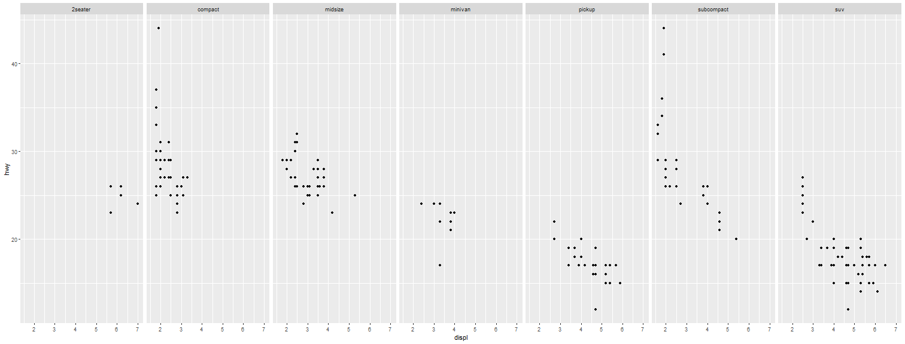

Data Visualization
========================================================
author: Andrea Pedot & Zak
date: 11/02/2021
width: 1440
height: 900

Contesto della serata
========================================================
L'obiettivo di questa prima parte è quello di darvi in mano gli strumenti di base dell' *esplorazione dei dati* il più rapidamente possibile. L'esplorazione dei dati è l'arte di guardare i dati, generare rapidamente ipotesi, testarle rapidamente, quindi ripeterle ancora e ancora.


Obiettivi della serata
========================================================

Questo capitolo mostrerà come visualizzare i dati usando *ggplot2*.
- gplot2 è uno dei più eleganti e versatili modi per creare grafici
- ggplot2 implementa il __grammar of graphics__, un sistema coerente per descrivere e costruire grafici
- imparare un sistema che si possa applicare velocemente in molti posti

Prerequisiti
========================================================
Per installare questo e altri pacchetti estremamente utili per la manipolazione dei dati basta eseguire


```r
install.packages("tidyverse") #prima volta
```
seguito poi dal comando che carica il core tidyverse, ovvero quei pacchetti che userete in quasi tutte le analisi dei dati.

```r
library(tidyverse)
```


Primi passi
========================================================
Usiamo il nostro primo grafico per rispondere a una domanda: le auto con motori grandi consumano più carburante delle auto con motori piccoli? Probabilmente avete già una risposta, ma cerchiamo di renderla precisa.
  - Qual è la relazione tra le dimensioni del motore e l'efficienza del carburante? 
  - È positiva? Negativa? Lineare? Non lineare?

Possiamo testare la nostra risposta con il `mpg` _data frame_ che si trova già in ggplot2 (l'import dei dati è argomento di un prossimo incontro).

Un data frame è una raccolta rettangolare di variabili (nelle colonne) e osservazioni (nelle righe). 

"mpg" contiene le osservazioni raccolte dalla US-EPA su 38 modelli di auto.

Il dataframe MPG /1
========================================================

```r
glimpse(mpg)
```

```
Rows: 234
Columns: 11
$ manufacturer <chr> "audi", "audi", "audi", "audi", "audi", "audi", "audi"...
$ model        <chr> "a4", "a4", "a4", "a4", "a4", "a4", "a4", "a4 quattro"...
$ displ        <dbl> 1.8, 1.8, 2.0, 2.0, 2.8, 2.8, 3.1, 1.8, 1.8, 2.0, 2.0,...
$ year         <int> 1999, 1999, 2008, 2008, 1999, 1999, 2008, 1999, 1999, ...
$ cyl          <int> 4, 4, 4, 4, 6, 6, 6, 4, 4, 4, 4, 6, 6, 6, 6, 6, 6, 8, ...
$ trans        <chr> "auto(l5)", "manual(m5)", "manual(m6)", "auto(av)", "a...
$ drv          <chr> "f", "f", "f", "f", "f", "f", "f", "4", "4", "4", "4",...
$ cty          <int> 18, 21, 20, 21, 16, 18, 18, 18, 16, 20, 19, 15, 17, 17...
$ hwy          <int> 29, 29, 31, 30, 26, 26, 27, 26, 25, 28, 27, 25, 25, 25...
$ fl           <chr> "p", "p", "p", "p", "p", "p", "p", "p", "p", "p", "p",...
$ class        <chr> "compact", "compact", "compact", "compact", "compact",...
```

Il dataframe MPG /2
========================================================
- manufacturer : nome del produttore
- model : nome del modello
- displ : cilindrata del motore, in litri
- year : anno anno di produzione
- cyl : numero di cilindri
- trans : tipo di trasmissione
- fl : tipo di carburante

***
- drv : tipo di trasmissione 
  - f se trazione anteriore, 
  - r se trazione posteriore,
  - 4 se 4x4
- cty : miglia cittadine per gallone
- hwy : miglia autostradali per gallone
- class : tipo di macchina

Il primo grafico con ggplot
========================================================

```r
ggplot(data = mpg) + 
  geom_point(mapping = aes(x = displ, y = hwy))
```


Sintassi di base
========================================================

```r
ggplot(data = <DATA>) +
  <GEOM_FUNCTION>(mapping = aes( <MAPPING> ))
```
- ggplot() crea un sistema di coordinate a cui si possono aggiungere strati. Il primo argomento è il **DATA** che può essere qualsiasi dataframe, ma da solo non serve a molto
- geom_point()` aggiunge uno strato fatto di punti (uno scatterplot) al ggplot
- Ogni **GEOM_FUNCTION** richiede un **MAPPING** che definisce come il dataset viene mappato nelle sue caratteristiche visibili
- il **MAPPING** è sempre contenuto all'interno di aes(), una funzione che racchiude quale variabile di **DATA** va mappata dove [es. la variabile "displ" sull'asse x, la variabile "hwy" sull'asse y]

Esercizi in itinere /1
========================================================
1. Eseguire `ggplot (data = mpg)`. Cosa vedi?
1. Quante righe ci sono in `mpg`? Quante colonne?
1. Cosa descrive la variabile `drv`? [Suggerimento: leggi la guida con `?mpg`]
1. Crea uno scatterplot di "hwy" vs "cyl".
1. Cosa succede se crei un grafico a dispersione di "class" vs "drv"? Perché non è un grafico utile?

Aesthetic mappings /1
========================================================
Queste auto hanno un chilometraggio più elevato di quanto potresti aspettarti. Come puoi spiegare queste auto che non rientrano nel trend lineare?


Aesthetic mappings /2
========================================================
Si può cambiare dimensione, forma e colore modificando i livelli delle estetiche (ovvero all'interno di `aes()`), e sono tutte associabili a una variabile di `mpg`.


Aesthetic mappings /3
========================================================


Aesthetic mappings /4
========================================================
Ad esempio, si potrebbe mappare la variabile `class` modificando l'estetica `color =`


```r
ggplot(data = mpg) + 
  geom_point(mapping = aes(x = displ, 
                           y = hwy, 
                           color = class))
```

Oppure avremmo potuto mappare `class` all'estetica _alpha_, che controlla la trasparenza dei punti, o all'estetica _shape_, che controlla la forma dei punti.
[ma shape ha solo 5 forme predefinite!]

Aesthetic mappings /5
========================================================
Una volta mappata un'estetica, ggplot2 si occupa del resto. Seleziona una scala ragionevole da utilizzare con l'estetica e costruisce una legenda (o degli assi) che spiegano la mappatura tra livelli e valori.

Possiamo anche _settare_ manualmente le proprietà estetiche del tuo `geom`. Ad esempio, possiamo rendere blu tutti i punti del nostro grafico:


```r
ggplot(data = mpg) + 
  geom_point(mapping = aes(x = displ, y = hwy), color = "blue")
```

=========================================================


Esercizi in itinere /2
=========================================================
1. Cosa è andato storto con questo codice? Perché i punti non sono blu?


```r
ggplot (data = mpg) +
  geom_point (mapping = aes (x = displ, y = hwy, color = "blue"))
```

2. Quali variabili in `mpg` sono categoriali? Quali variabili sono continue?

3. Mappare una variabile continua a "color", "size" e "shape". Come faccio
     queste estetiche si comportano in modo diverso per categorico vs. continuo
     variabili?
    
***    
4. Cosa succede se si mappa la stessa variabile su più estetiche?
    
5. Cosa succede se si mappa un'estetica su qualcosa che non è una variabile, come ad esempio `aes (color = displ <5)`? Nota, dovrai anche specificare x e y.


Facet /1
=========================================================
Un altro modo per aggiungere ulteriori variabili, particolarmente utile per le variabili categoriali, è quello di dividere il grafico in __facets__, minigrafici in cui ciascuno visualizza un sottoinsieme dei dati.

Per farlo si usa `facet_wrap ()`. Il primo argomento di `facet_wrap ()` dovrebbe essere una _formula_, che si crea con `~` seguito da un nome di variabile. Attenzione che la variabile deve essere discreta.


```r
ggplot(data = mpg) + 
  geom_point(mapping = aes(x = displ, y = hwy)) + 
  facet_wrap(~ class, nrow = 2)
```

Per suddividere il grafico sulla combinazione di due variabili, si aggiunge `facet_grid ()` Anche il primo argomento di "facet_grid ()" è una formula, ma con due variabili separate dalla "~" o con un "." invece della variabile [ad es. `+ facet_grid (. ~ cyl)` ] per non suddividere sulle righe.


```r
ggplot(data = mpg) + 
  geom_point(mapping = aes(x = displ, y = hwy)) + 
  facet_grid(drv ~ cyl)
```

Facet /2
=========================================================

***


Esercizi in itinere /3
=========================================================
1. Cosa succede se si sfaccetta su una variabile continua?

2. Cosa significano le celle vuote nel grafico con "facet_grid (drv ~ cyl)"?
    Come si relazionano a questo plot?
    

```r
ggplot (data = mpg) +
  geom_point (mapping = aes (x = drv, y = cyl))
```

3. Quali grafici crea il codice seguente? Cosa fa `.`?


```r
ggplot (data = mpg) +
  geom_point (mapping = aes (x = displ, y = hwy)) +
  facet_grid (drv ~.)
    
ggplot (data = mpg) +
  geom_point (mapping = aes (x = displ, y = hwy)) +
  facet_grid (. ~ cyl)
```

4. Quando si usa `facet_grid ()` di solito si mette la variabile con più livelli unici nelle colonne. Perché?

Esercizi in itinere /4
=========================================================
5. Prendendo questo grafico, quali sono i vantaggi nell'usare la suddivisione al posto dell'estetica del colore? Quali sono gli svantaggi? Come potrebbe cambiare l'equilibrio se avessi un dataset più grande?


```r
ggplot (data = mpg) +
  geom_point (mapping = aes (x = displ, y = hwy)) +
  facet_wrap (~ class, nrow = 1)
```



Grazie a tutti
========================================================
:)
