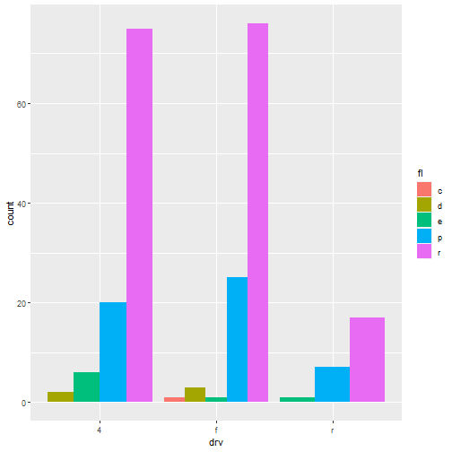

02_visualize
========================================================
author: Andrea Pedot
date: 18/02/2021
width: 1200
height: 800

Bentornati
========================================================

Recap della scorsa volta

- `ggplot( DATA ) +`
- `geom_point(mapping = aes(x = , y = , size = , color =)) +`
- `geom_smooth() +   # negli esercizi a casa`
- `facet_wrap( ~ EQUAZIONE )`

Obiettivi della serata
========================================================

- altre geometrie e trasformazioni statistiche completamente automatiche
- posizionamento dei grafici e sistemi di coordinate

Si parte sempre con

```r
library(tidyverse)
```

Geometrie di base /codice
========================================================

Le `geom` sono l'oggetto geometrico che il plot usa per rappresentare i dati (i bar chart usano le barre, i grafici a linee le linee, gli scatterplot i punti, ...).

Per cambiare le geometrie basta cambiare la funzione `geom` che si aggiunge al `ggplot()`.

Ogni funzione `geom` prende un argomento `mapping = `, ma attenzione che non tutte le estetiche funzionano con tutte le funzioni.

***

Ad esempio, non esiste `aes( shape = ...)` per una linea creata con `geom_line()`, ma esiste `aes( linetype = ...)`


Geometrie di base /grafici
========================================================


```r
ggplot(data = mpg) + 
  geom_point(mapping = 
      aes(x=displ, y=hwy) )
```


***


```r
ggplot(data = mpg) + 
  geom_smooth(mapping = 
      aes(x=displ, y=hwy) )
```


Combinare geometrie /codice
========================================================
ggplot2 ha più di 40 geoms, e gli extension packages ne aggiungono molti altri. 

Il miglior modo per avere una panoramica generale è usare il cheatsheet di gglplot 2, che si può trovare su <http://rstudio.com/resources/cheatsheets>.

Come sempre, per approfondire una `geom` si può usare `?geom_smooth`

Tornando al grafico delle slide precedenti, combinare più geometrie su un unico grafico è estremamente semplice


```r
# le aes definite in ggplot() si ereditano in tutte le geom()
ggplot(data = mpg, 
       mapping = aes(x = displ, 
                     y = hwy,
                     color = drv) ) + 
  geom_point() +
# aes definite nella geom rimangono locali
  geom_smooth(mapping = aes(linetype = drv))
```

Combinare geometrie /grafico
========================================================


Geometrie con dati particolari /codice
========================================================
Il parametro **DATA** in `ggplot(data = ...)` viene anche lui ereditato in tutte le funzioni `geom()` che aggiungiamo, ma possiamo scegliere di specificarlo localmente, semplicemente definendo il parametro `data = ` all'interno della funzione `geom()`


```r
ggplot(data = mpg, 
       mapping = aes(x = displ, 
                     y = hwy) ) + 
  geom_point(mapping = aes(color = class)) + 
  geom_smooth(data = filter(mpg, class == "subcompact"), 
              se = FALSE)
```

Oppure si possono usare filtri in base al valore


```r
geom_smooth(data = # mostra una smooth fatta solo sulle auto 
            filter(mpg, cyl >= 6) )    # a grande cilindrata
```


Geometrie con dati particolari /grafico
========================================================


Esercizi /1
========================================================

1. Prova a immaginare che grafico produrrà questo codice


```r
ggplot(data = mpg, mapping = aes(x = displ, y = hwy, color = drv)) + 
  geom_point() + 
  geom_smooth(se = FALSE)
```

1. In cosa saranno diversi questi due grafici?


```r
ggplot(data = mpg, mapping = aes(x = displ, y = hwy)) + 
  geom_point() + 
  geom_smooth()

ggplot() + 
  geom_point(data = mpg, mapping = aes(x = displ, y = hwy)) + 
  geom_smooth(data = mpg, mapping = aes(x = displ, y = hwy))
```

Esercizi /2
========================================================

1. 1. Quale `geom()` si usa per disegnare un istogramma? Un boxplot? Un grafico ad area? Una heatmap?

1. A cosa serve l'argomento `se = ...` di `geom_smooth()`?

1. Prova a ricreare il codice per questi due grafici

***


Trasformare i dati
========================================================


```r
ggplot(data = mpg) + 
  geom_bar(mapping = 
             aes(x = drv))
```


***

In questo grafico a barre sull'asse y c'è count, ma non c'è nessuna variabile `count` nel dataset di partenza. Come è possibile?

Alcune `geom_()` ( come anche `geom_boxplot()`, `geom_histogram` e `geom_density()` ) operano delle trasformazioni statistiche sui dati prima del plotting, chiamate `stat`

Schema in breve
========================================================


Ogni `geom()` ha una `stat()` di default, e viceversa.

La pagina help di `?geom_bar` è la stessa di `?stat_count()` e alla sezione **Computed variables** si può vedere che calcola due nuove variabili: `count` e `prop`

Stat = "identity"
========================================================
`geom_bar( stat = "identity" )` si usa tutte quelle volte che avete già calcolato la statistica riassuntiva e volete fare il grafico "così com'è".


```r
demo <- tribble(
  ~cut,         ~freq,
  "Very Good",  12082,
  "Premium",    13791,
  "Ideal",      21551
)

ggplot(data = demo) +
  geom_col(mapping = aes(x = cut, 
                         y = freq))
```

***


`ggplot` vi mette a disposizione anche `geom_col()` che fa esattamente la stessa cosa.

after_stat() per usare altre *computed variables*
========================================================


```r
ggplot(data = mpg) + 
  geom_bar(mapping = aes(x = drv, 
                         y = after_stat(prop), 
                         group = 1))
```


stat_summary()
========================================================
Ci sono più di 20 `stat_function()` e il codice è estremamente personalizzabile


```r
ggplot(data = mpg) + 
  stat_summary(
    mapping = aes(x = class, 
                  y = displ),
    fun.min = min,
    fun.max = max,
    fun = median
  )
```

***


Esercizi /3
========================================================
1. Qual è la `geom` predefinita associata a `stat_summary()`? Come si può riscrivere il grafico precedente per usare quella funzione geom invece della funzione stat?

1. Quali variabili (**computed variables**) calcola `stat_smooth()`? Quali parametri invece controllano il suo comportamento?

1. Nel nostro grafico a barre delle proporzioni, dobbiamo impostare "group = 1". Perché? In altre parole, qual è il problema con questi due grafici?

***


Un altro blocco: Position
========================================================

```r
ggplot(data = mpg) + 
  geom_bar(mapping = 
             aes(x = drv,
                 fill = drv))
```


```r
# fill -> riempimento
# color -> bordi
```

***


```r
ggplot(data = mpg) + 
  geom_bar(mapping = 
             aes(x = drv,
                 fill = fl))
```


Un altro blocco: Position /2
========================================================
In automatico un attributo diverso all'estetica `fill =` definisce un posizionamento della varie barre "una sopra l'altra".

In questo caso del `geom_bar()` il valore predefinito è `position = "stack"`, ma ne esistono 5 in tutto:
- `position = "identity"` per le sovrapposizioni (accoppiato ad `alpha = ` tra 0 e 1 per vedere in trasparenza)
- `position = "dodge"` per l'affiancamento
- `position = "jitter"` per lo sparpagliamento
- `position = "fill"` per il riempimento in proporzione
- `geom_label(position = "nudge")` per evitare che le etichette si sovrappongano

Esempi di posizionamenti /1
========================================================

```r
  position = "dodge"
```



***


```r
  position = "identity",
  alpha = 0.33
```


Esempi di posizionamenti /2
========================================================


```r
  position = "fill"
```


***


```r
  position = "jitter"
```


Esercizi /4
========================================================
1. Qual è il problema con il grafico a destra? Come si può migliorare?

1. Come si calcola la quantità di jittering?

1. Comparando `geom_jitter()` e `geom_count()`, quando è più utile l'uno? Quando è più utile l'altro?

1. Qual è la position di default di `geom_boxplot()`?

***


```r
ggplot(data = mpg, 
       mapping = 
         aes(x = cty, 
         y = hwy) ) + 
  geom_point()
```


Sistemi di coordinate /1
========================================================

`+ coord_flip()` per ribaltare il grafico e renderlo più leggibile


***

`+ coord_fixed( ratio = 1 )` per renderlo quadrato


```r
ggplot(data = mpg, 
       aes(x = cty, 
           y = hwy)) +
  geom_point() +
  coord_fixed()
```


Sistemi di coordinate /2
========================================================

`coord_polar( theta = "y" )` per renderlo polare (theta = "y" per renderlo un grafico a torta)


```r
ggplot(mpg, aes(x = 1, fill = factor(cyl)) ) +
  geom_bar() +
  coord_polar(theta = "y")
```


La Grammar of Graphics
========================================================
```
# required
ggplot(data = <DATA>) + 
  <GEOM_FUNCTION>(
     mapping = aes(<MAPPINGS>),

# not required (default)
     stat = <STAT>, 
     position = <POSITION>
  ) +
  <COORDINATE_FUNCTION> +
  <FACET_FUNCTION> +
  <SCALE_FUNCTION> +
  
# formattazione 
  <THEME_FUNCTION> +
  <LABELS> +
```
***

```r
# required
ggplot(data = mpg) + 
  geom_point( mapping = 
    aes(x = class,
    y = year,
    color = model),
# not required (default)
  show.legend = FALSE,
  stat = "identity", 
  position ="jitter") +
  coord_flip() +
  facet_wrap(~manufacturer) +
  scale_y_continuous() +
  
# formattazione 
  theme_dark() +
  labs( title = "Auto manufacturing")
```

...e i grafici a strati che crea
========================================================


Grazie a tutti
========================================================
:)
